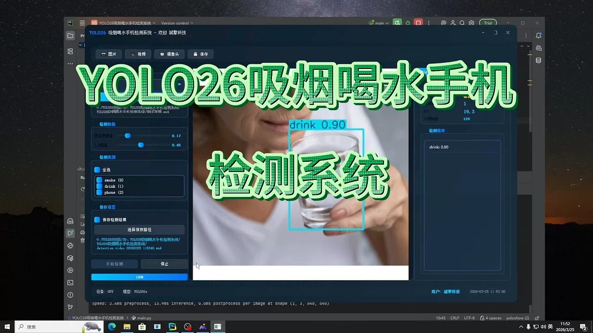
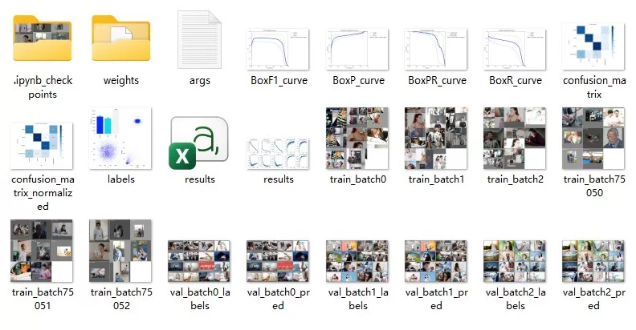
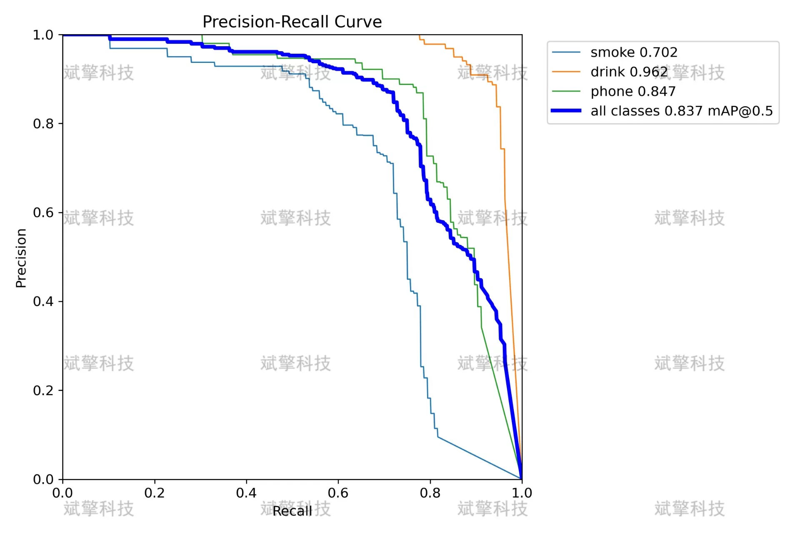
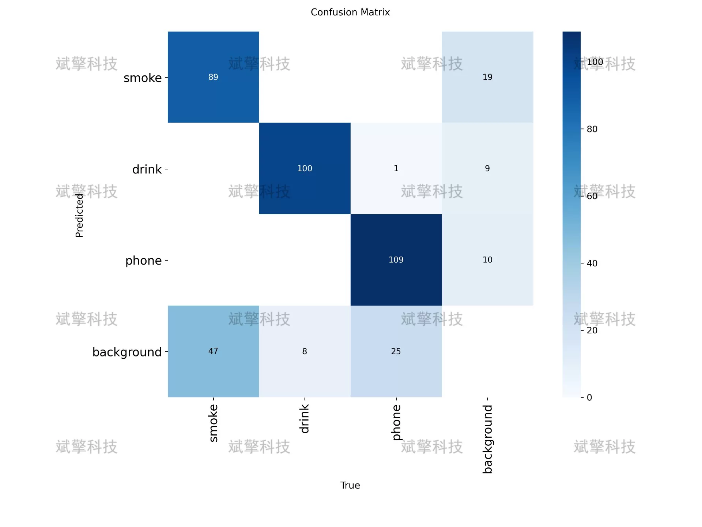
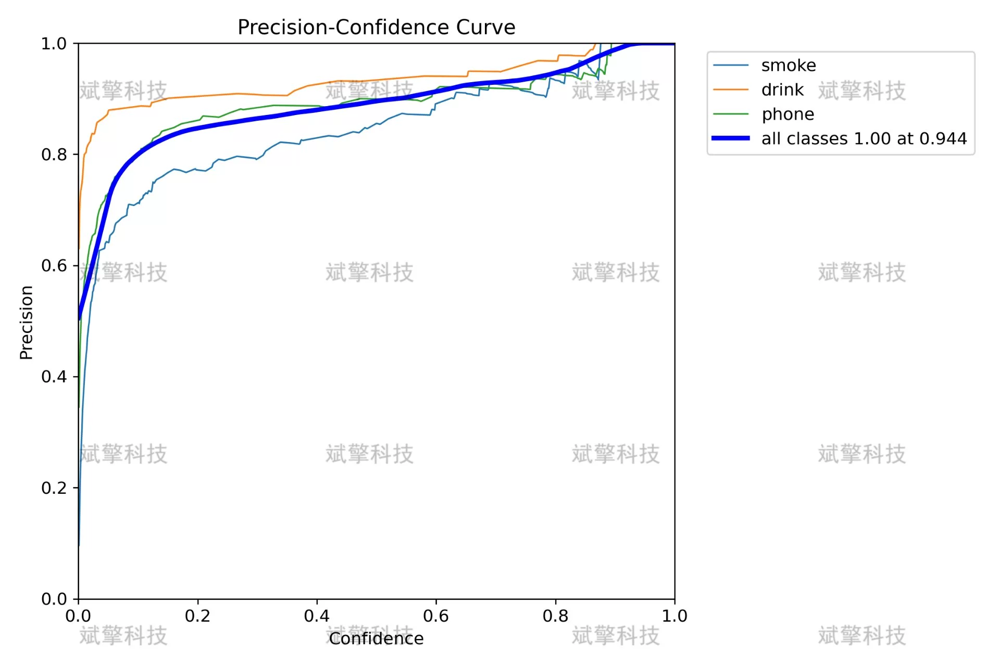
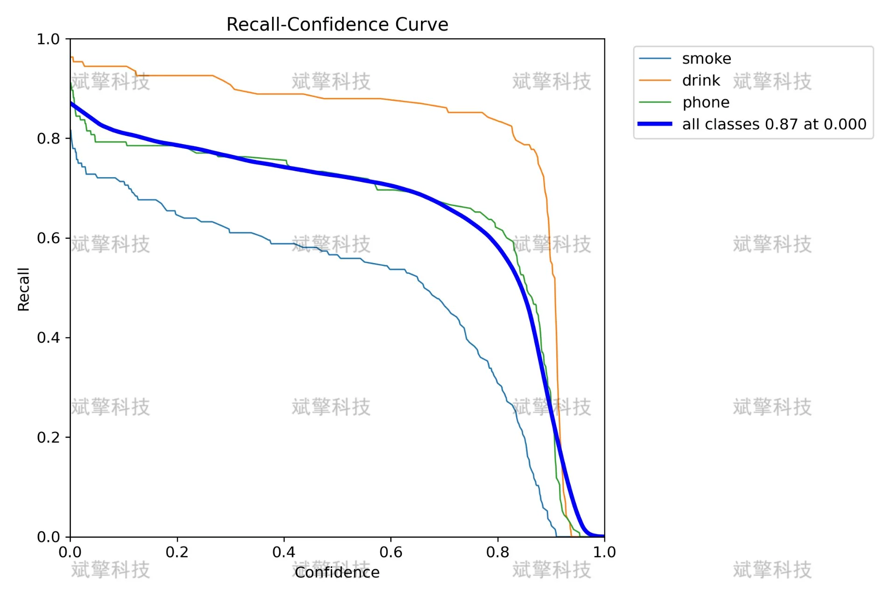
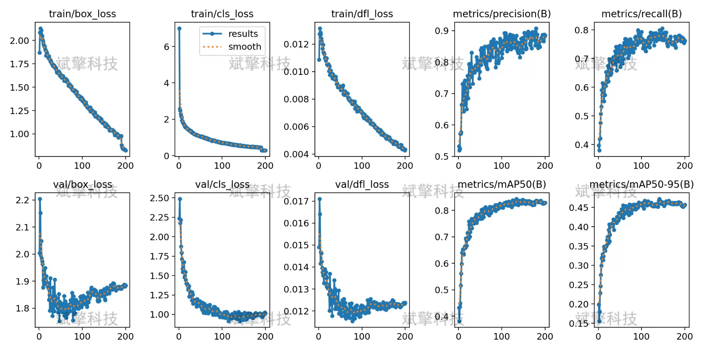
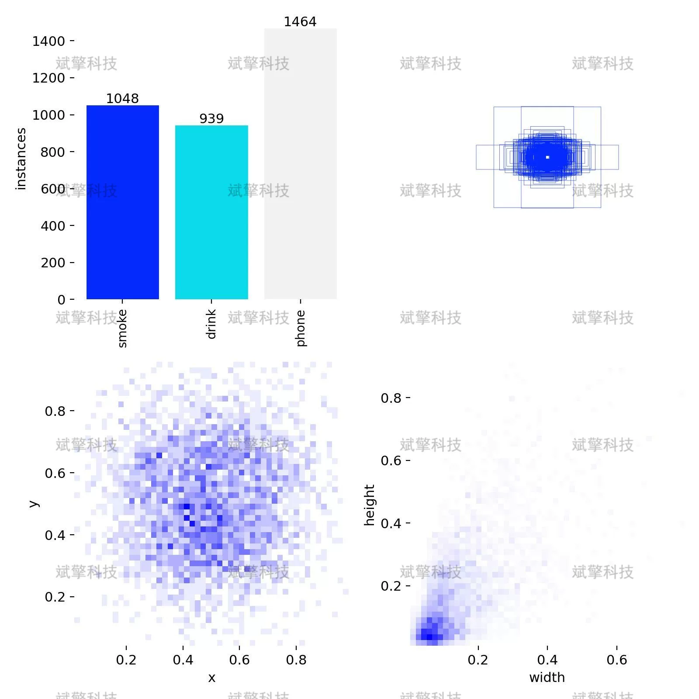
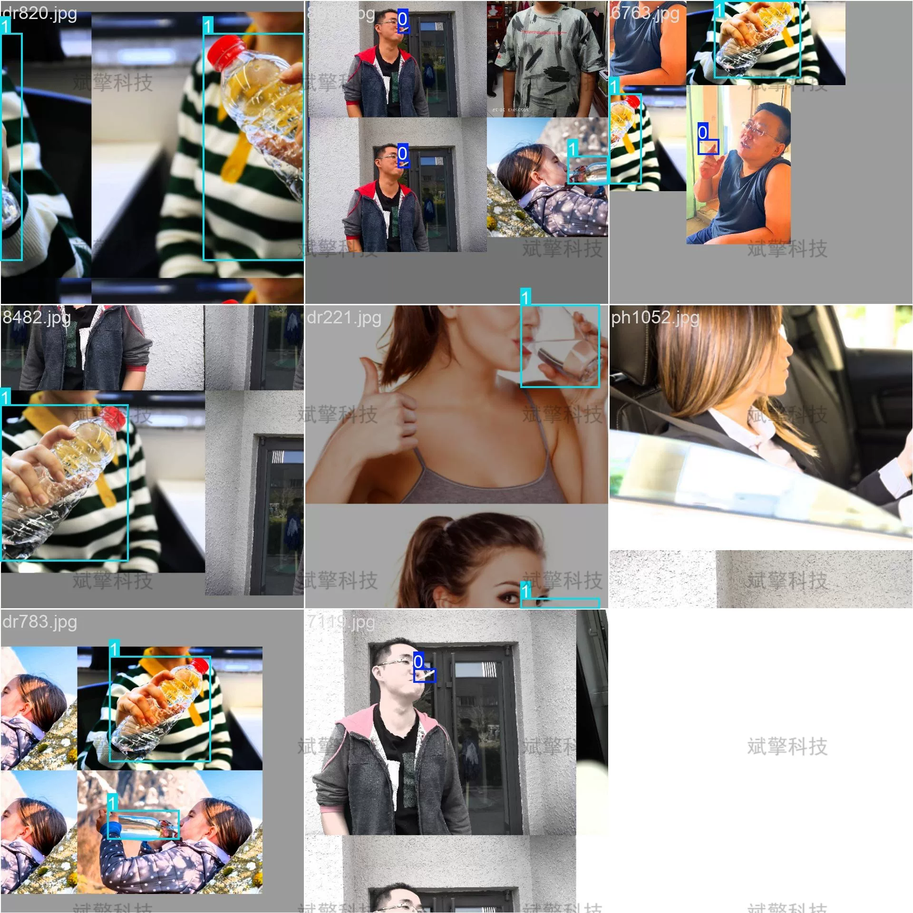

# YOLO26 Smoking and Drinking Mobile Phone Detection System | Model

## Body

YOLO26 Smoke, Drink, and Phone Detection System | Model YOLO26 Real-World: Smoke/Drink/Phone Detection System with an mAP of 0.837

This report is based on the YOLO26 object detection algorithm and constructs a multi-class detection system for smoking, drinking, and phone calls in surveillance scenarios. The system was trained using 3157 images and validated with 350 images, covering three target categories: smoking (smoke), drinking (drink), and calling (phone). Through comprehensive analysis of multiple indicators such as confusion matrix, precision-recall curve, and loss curve during training, the model's detection performance is evaluated.
The results show that the model performs best in the category of drinking (with a recall rate of 0.962), good in the category of calling (with a recall rate of 0.847), and relatively low in the category of smoking (with a recall rate of 0.702). Overall, the mAP@0.5 reaches 0.837, indicating high accuracy at high confidence thresholds and very low false positive rates for background. This system can provide effective technical support for public places safety monitoring, workplace compliance management, etc.
The system uses self-collected and labeled image datasets containing three categories:
smoke (smoking): detecting people holding cigarettes or smoking behavior
drink (drinking): detecting people holding cups, bottles, and other containers to drink water
phone (phone): detecting people holding phones close to their ears or operating them
The dataset consists of 3507 images, including:
Training set: 3157 images (about 90%)
Validation set: 350 images (about 10%)

Free reservation for remote installation. Unsuccessful installation will result in a full refund.
Purchase comes with the following resources (unlocked by Baidu Cloud):
YOLO recognition detection project complete source code
YOLO format datasets
Training code + UI interface code
Trained model + results images
Software installer
Add WeChat to make a reservation for remote installation (automatically display WeChat ID after purchase) - Unsuccessful, full refund

⚙️ Core Functional Modules
Detection Capability
Image detection: upload and check immediately, returning detection boxes + category information
Video detection: supports video files, analyzing frames accurately
Camera real-time detection: connects to USB cameras to achieve dynamic monitoring
Interaction and Control
Target selection: freely choose one or more categories for detection
Parameter real-time adjustment: adjustable confidence threshold & IoU threshold, flexible control over accuracy
Result saving: save images/videos/camera detection results in one click
System and Data
User login registration: supports password strength checking + encryption storage
Log recording: automatically records operation and error information (timestamped)

## Images

## Payment

Here is a pay link on Stripe ( https://buy.stripe.com/3cs8yP7sY87d0vu9AB ). Please contact me lonlonago@foxmail.com after funding $89, and I will send you a complete data files , thank you!

